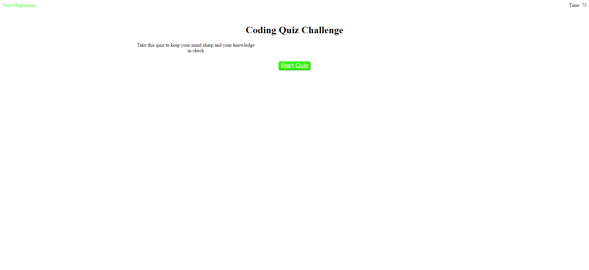
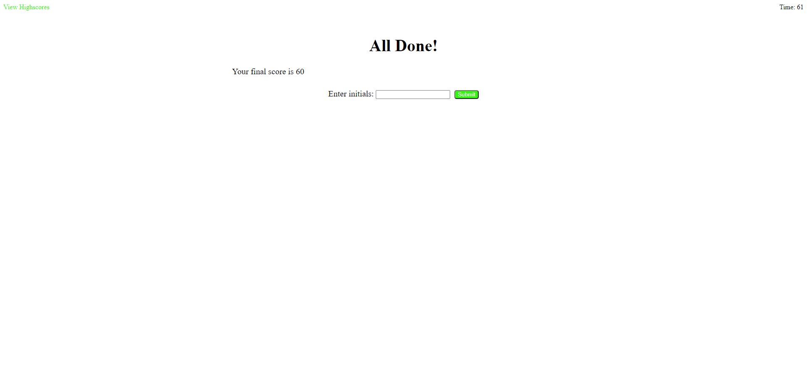

# Code-Quiz

I had to delete the old repo and start a new one.

> Take a Coding Quiz to develop and sharpen your skills as a developer
>[Link to website](https://philippowers67.github.io/DoYouHaveTheAnswers/)
## Table of Contents
* [Description](#Description)
* [General Info](#General-Info)
* [Features](#Features)
* [ScreenShot](#ScreenShot)
## Description
Using JavaScript, HTML, and CSS this application starts a coding quiz with a time limit.
## General Info
High Scores are stored in local storage after completing the quiz.
## Features
* Timed Quiz
* Start buttons to start quiz and timer
### ScreenShot

